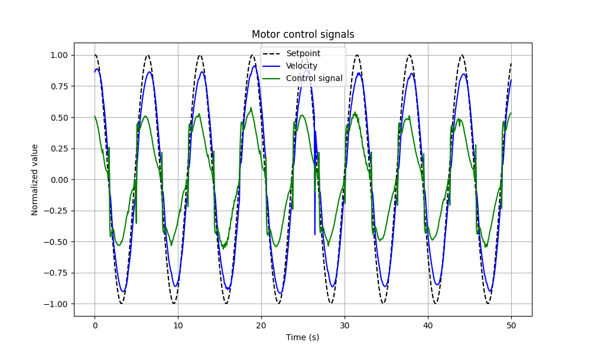
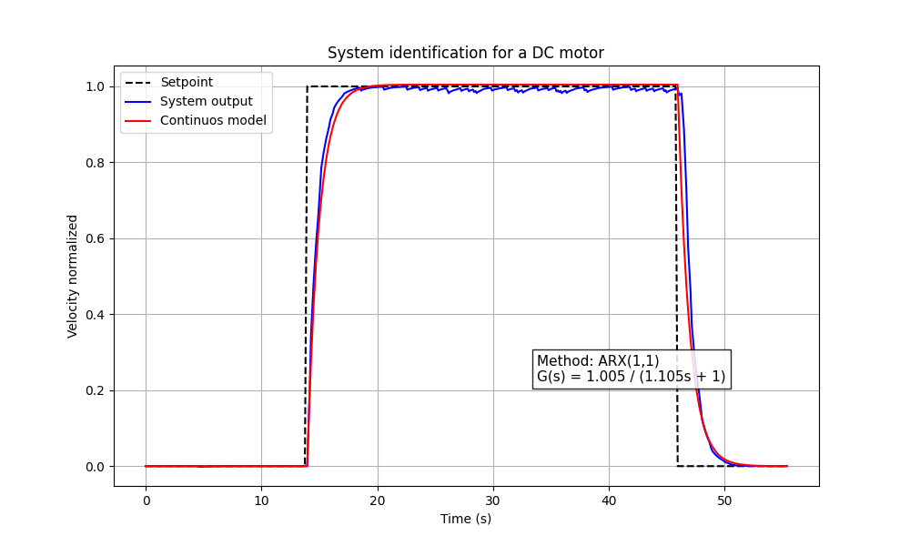
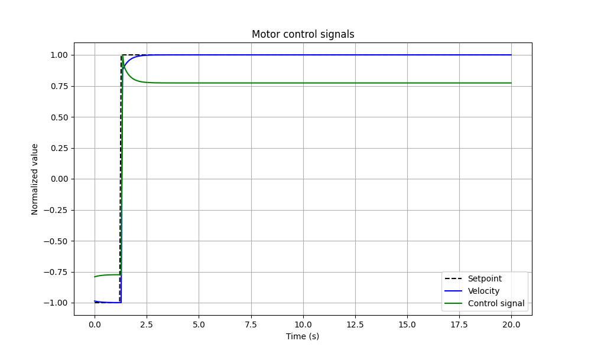
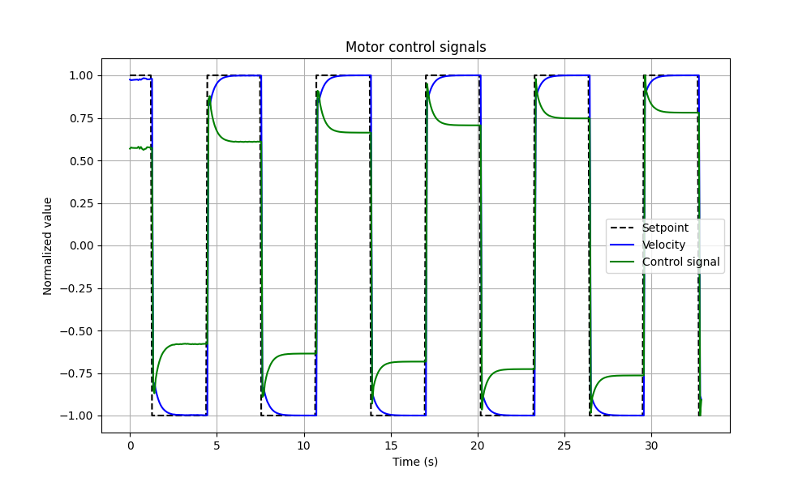
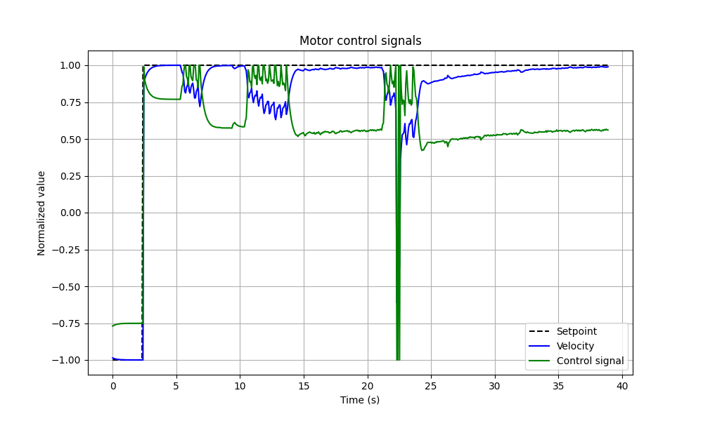
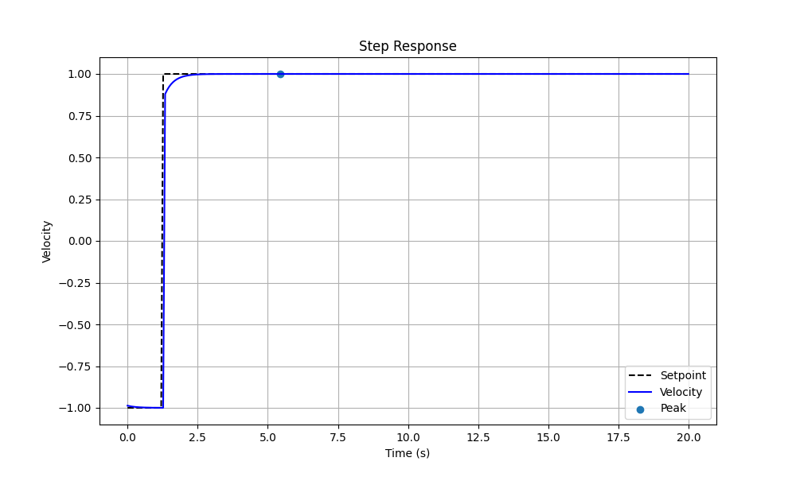

# DC Motor Speed Control with micro-ROS and ROS 2

<p align="center">
  
</p>

<p align="center">
  
  
  
  
</p>

## Description

This project implements a **closed-loop speed control system for a DC motor with an encoder**, using **micro-ROS on an ESP32** and **ROS 2 on a computer**.

The system is able to:

- Receive a speed reference from ROS 2
- Run an incremental PID controller on the microcontroller itself
- Measure the motor's speed through an incremental encoder
- Publish the measured speed back to ROS 2
- Publish time, setpoint, control signal, and measured speed to a ROS 2 node
- Generate test signals (sine, square, triangle, and step)
- Visualize and analyze the system's response in real time
- Log data for later analysis

The project was built in two stages: first, the real motor's dynamics were identified in open loop; then, that model guided the design of the PID controller that runs in closed loop on the ESP32. The end goal is to evaluate that controller's performance against different reference signals.

## Table of Contents

- [System Architecture](#system-architecture)
- [System Diagram](#system-diagram)
- [System Identification](#system-identification)
- [ROS 2 Topics](#ros-2-topics)
- [Hardware Used](#hardware-used)
- [Speed Measurement](#speed-measurement)
- [micro-ROS Connection State Machine](#micro-ros-connection-state-machine)
- [Controller Implementation](#controller-implementation)
- [Test Signal Generation](#test-signal-generation)
- [Data Logging](#data-logging)
- [Control Considerations](#control-considerations)
- [Repository Structure](#repository-structure)
- [Running the System](#running-the-system)
- [Results](#results)
- [Report and Video](#report-and-video)
- [Authors](#authors)

---

# System Architecture

The system is split into two main parts.

### Computer (ROS 2)

- Reference signal generation (`set_point_node`)
- Data logging for later analysis (`save_data`)
- Real-time visualization (`rqt_plot`)

### ESP32 (micro-ROS, node `motor_control`)

- Reading the setpoint
- Reading the encoder
- Computing velocity
- Running the PID controller
- Generating PWM for the motor
- Publishing the required data

---

# System Diagram

```
   PC (ROS 2)                                ESP32 (micro-ROS, node "motor_control")
 ┌─────────────────┐    /set_point         ┌────────────────────────────┐
 │  set_point_node  │ ─────────────────────►│   Incremental PID           │  PWM + Dir   ┌───────┐   ┌───────────┐
 │                  │                       │   (Kp=1.6, Ki=0.6, Kd=0.02) │─────────────►│ L298N │──►│ DC Motor  │
 └─────────────────┘                       │                             │              └───────┘   │ + Encoder │
 ┌─────────────────┐    /motor_output      │                             │◄──── pulses ──────────────┘└───────────┘
 │   save_data      │◄──────────────────────│                             │
 └─────────────────┘                       └──────────────┬──────────────┘
 ┌─────────────────┐    /motor_velocity                    │
 │   rqt_plot       │◄──────────────────────────────────────┘
 └─────────────────┘
```

---

# System Identification

Before designing the controller, the real motor's dynamics were identified in **open loop**, using the [`firmware/identificacion_motor.ino`](firmware/identificacion_motor.ino) firmware: it applies the `/set_point` value directly as a PWM magnitude (no controller at all) and publishes `/motor_output` as just `[time, setpoint, velocity]` — just enough to log the motor's step response.

From that logged response (`motor_data.csv`), [`csv_data/scripts/sistem_identification.py`](csv_data/scripts/sistem_identification.py) fits an ARX(1,1) model via least squares and converts it into a continuous first-order transfer function:

```
G(s) = K / (τs + 1)
```

Result obtained:

```
G(s) = 1.005 / (1.105s + 1)
```

<p align="center">
  
</p>
<p align="center"><em>Open-loop step response of the real motor (blue) vs. the fitted first-order model (red).</em></p>

This model's step response was the starting point for proposing the PID gains, which were later fine-tuned manually to `Kp=1.6, Ki=0.6, Kd=0.02`.

---

# ROS 2 Topics

| Topic | Type | Description |
|------|------|------|
| `/set_point` | `std_msgs/Float32` | Normalized speed reference |
| `/motor_velocity` | `std_msgs/Float32` | Normalized measured speed |
| `/motor_output` | `std_msgs/Float32MultiArray` | `[time, setpoint, control_signal, normalized velocity]` |

All signals are normalized to the range:

```
-1 ≤ signal ≤ 1
```

where:

```
motor_output = rpm / RPM_MAX
```

---

# Hardware Used

| Component | Model / Type | Relevant specs |
|---|---|---|
| Microcontroller | ESP32 Development Board | 240 MHz CPU, WiFi/Bluetooth, PWM, serial comms |
| DC motor with encoder | JGA25-370 | Integrated quadrature encoder, 140 RPM - 12V |
| Motor driver | L298N (dual H-bridge) | PWM control, up to 2A per channel |
| Power supply | External DC supply | Powers the motor at 12V |
| Computer | Laptop (Ubuntu) | Runs ROS 2 and supervises the system |

### Pin Connections

| Signal | ESP32 Pin |
|------|------|
| Encoder A | GPIO 14 |
| Encoder B | GPIO 13 |
| Motor PWM | GPIO 27 |
| Direction IN1 | GPIO 25 |
| Direction IN2 | GPIO 26 |

---

# Speed Measurement

Motor speed is computed from the encoder pulse count, accumulated every sampling period `Ts` and read through an interrupt:

```
rpm_raw = (pulseCount * 60) / (PULSES_PER_REV * Ts)
```

where:

```
PULSES_PER_REV = 495
Ts = 0.05 s   (0.1 s during open-loop identification)
```

An exponential filter is then applied to smooth the signal:

```
rpm_filt = α * rpm_raw + (1 - α) * rpm_prev     # α = 0.20
velocity = rpm_filt / RPM_MAX                    # normalized to [-1, 1]
```

---

# micro-ROS Connection State Machine

Both ESP32 firmware variants (identification and final control) implement the same 4-state machine so the board survives the micro-ROS agent appearing, disappearing, and reappearing — without ever needing a manual reset:

| State | Meaning |
|---|---|
| `WAITING_AGENT` | No agent yet; pings every 500 ms |
| `AGENT_AVAILABLE` | Agent found; creates the node and its entities (`create_entities()`) |
| `AGENT_CONNECTED` | Entities live; pings every 200 ms and spins the executor |
| `AGENT_DISCONNECTED` | Ping failed; destroys entities and falls back to `WAITING_AGENT` |

Communication with the agent is over **Serial** (`set_microros_transports()`).

---

# Controller Implementation

An **incremental discrete PID** was implemented, running directly on the ESP32 ([`firmware/mcr2_challenge_final.ino`](firmware/mcr2_challenge_final.ino)):

```
u(k) = u(k-1)
       + Kp (e(k) - e(k-1))
       + Ki Ts e(k)
       + Kd/Ts (e(k) - 2e(k-1) + e(k-2))
```

where:

```
e(k) = reference - measured velocity
```

Gains used:

```
Kp = 1.6
Ki = 0.6
Kd = 0.02
```

The control signal is saturated to:

```
0 ≤ u ≤ 1
```

and then converted to PWM:

```
PWM = u * 255
```

---

# Test Signal Generation

A ROS 2 Python node (`set_point`) generates different reference signals.

Available signal types:

- `sine`
- `square`
- `triangle`
- `step`

The signal type can be changed dynamically via a parameter, without restarting the node:

```
ros2 param set /set_point_node signal_type sine
```

---

# Data Logging

During testing, `save_data` subscribes to `/motor_output` and appends every sample to a CSV file with the format:

```
time, setpoint, control, velocity
```

This allows the controller's performance to be analyzed later with the scripts in [`csv_data/scripts/`](csv_data/scripts/).

---

# Control Considerations

The system runs its control loop at:

```
10-20 Hz   (Ts = 0.1 s during identification, Ts = 0.05 s during final control)
```

The motor's dynamics fall roughly between:

```
2 – 5 Hz
```

so the rule of thumb is satisfied:

```
f_control ≥ 10 × f_dynamics
```

---

# Repository Structure

```
challenge_control_PID_using_ROS2/
├── control_motor_challenge/         # ROS 2 package (ament_python)
│   └── control_motor_challenge/
│       ├── set_point.py             # reference signal generator node
│       └── save_data.py             # /motor_output → motor_data.csv logger
├── firmware/
│   ├── identificacion_motor.ino     # Stage 1: open-loop, for system identification
│   └── mcr2_challenge_final.ino     # Stage 2: closed-loop incremental PID (final)
├── csv_data/
│   ├── scripts/
│   │   ├── sistem_identification.py # ARX(1,1) identification (reads motor_data.csv)
│   │   ├── plot_csv.py              # plot setpoint/velocity/control + tracking error
│   │   └── control_analisis.py      # step-response metrics (rise/settling time, overshoot, RMSE...)
│   ├── data/                        # archived logged test runs
│   │   ├── sine.csv
│   │   ├── square.csv
│   │   ├── step.csv
│   │   └── step_perturbations.csv
│   └── plots/                       # exported plots referenced in the report
│       ├── system_identification.png
│       ├── sine.png / sine_error.png
│       ├── square.png / square_error.png
│       ├── step.png / step_error.png
│       ├── step_perturbations.png / step_perturbations_error.png
│       └── control_analysis.png / control_analysis_error.png
├── report/
│   ├── reporte_final.pdf            # submitted final report
│   └── presentacion_final.pdf       # submitted final presentation
└── README.md
```

&ensp;&ensp;`csv_data/scripts/plot_csv.py` and `control_analisis.py` take an optional
CSV filename argument (default `square.csv` / `step.csv`), resolved against
`csv_data/data/` when the given name isn't found relative to the current directory —
e.g. `python3 plot_csv.py step_perturbations.csv`. `sistem_identification.py` instead
defaults to `motor_data.csv` in the current directory, since that file is produced
live by `save_data` right after an identification run, not archived in `data/`.

---

# Running the System

## Stage 1 — Identify the real motor

> **Note:** `motor_data.csv` from the original identification run was not saved to
> this repository — only its resulting plot
> ([`csv_data/plots/system_identification.png`](csv_data/plots/system_identification.png))
> and the fitted model (`G(s) = 1.005 / (1.105s + 1)`) were kept. Running steps 1-3
> below regenerates a fresh `motor_data.csv` that step 4 can then fit.

1. Flash [`firmware/identificacion_motor.ino`](firmware/identificacion_motor.ino) to the ESP32.
2. Start the micro-ROS agent:
    ```
    ros2 run micro_ros_agent micro_ros_agent serial --dev /dev/ttyUSB0
    ```
3. Generate a step reference and log the response:
    ```
    ros2 run control_motor_challenge set_point --ros-args -p signal_type:=step
    ros2 run control_motor_challenge save_data
    ```
4. Fit the model from the logged data:
    ```
    cd csv_data/scripts
    python3 sistem_identification.py ../../motor_data.csv   # or wherever it was written
    ```

## Stage 2 — Run the final closed-loop controller

1. Flash [`firmware/mcr2_challenge_final.ino`](firmware/mcr2_challenge_final.ino) to the ESP32.
2. Start the micro-ROS agent:
    ```
    ros2 run micro_ros_agent micro_ros_agent serial --dev /dev/ttyUSB0
    ```
3. Generate the reference signal and log the data:
    ```
    ros2 run control_motor_challenge set_point
    ros2 run control_motor_challenge save_data
    ```
4. Visualize live:
    ```
    ros2 run rqt_plot rqt_plot
    ```
    Plot the topics:
    ```
    /set_point/data
    /motor_velocity/data
    ```
5. Switch the reference signal on the fly:
    ```
    ros2 param set /set_point_node signal_type square
    ros2 param set /set_point_node signal_type step
    ```
6. Analyze a logged run:
    ```
    cd csv_data/scripts
    python3 plot_csv.py square.csv          # setpoint / velocity / control + tracking error
    python3 control_analisis.py step.csv    # rise time, overshoot, settling time, RMSE...
    ```

---

# Results

Four experiments were run with the final closed-loop controller. Each plot shows the setpoint, the measured velocity, and the control signal; the corresponding `*_error.png` in [`csv_data/plots/`](csv_data/plots/) shows the tracking error over the same run.

<table>
<tr>
<td width="50%">

<p align="center"><b>Step</b></p>

<p align="center">Fast, accurate response, going from -1.0 to +1.0 within a few seconds.</p>

</td>
<td width="50%">

<p align="center"><b>Square</b></p>

<p align="center">The most demanding case — error reaches ±2.0 only during the ±1↔-1 transitions, then returns to ~0 quickly.</p>

</td>
</tr>
<tr>
<td width="50%">

<p align="center"><b>Sine</b></p>

<p align="center">Tracks the reference closely, error stays within ±0.2; a brief spike near t=25s at a direction change.</p>

</td>
<td width="50%">

<p align="center"><b>Step with perturbations</b></p>

<p align="center">Manual resistance applied to the shaft (t=5-20s) causes oscillation, but the controller recovers the setpoint.</p>

</td>
</tr>
</table>

<p align="center">
  
</p>
<p align="center"><em>Step-response metrics computed by <a href="csv_data/scripts/control_analisis.py">control_analisis.py</a>: rise time, overshoot, and settling time.</em></p>

**Conclusions from the report:** the system is stable in every tested scenario. The identified improvements are specific and actionable: adding **anti-windup** to the integral term (not implemented — it can cause overshoot after prolonged saturation), and using a time-between-pulses measurement method to improve velocity resolution at low RPM.

---

# Report and Video

**📄 Final report** — [report/reporte_final.pdf](report/reporte_final.pdf)
**📊 Final presentation** — [report/presentacion_final.pdf](report/presentacion_final.pdf)

---

# Authors

- José Eduardo Sánchez Martínez     IRS | A01738476
- Josue Ureña Valencia              IRS | A01738940
- César Arellano Arellano           IRS | A00839373
- Rafael André Gamiz Salazar        IRS | A00838280

Project developed as part of a control challenge using **ROS 2 and micro-ROS** for the industry partner ManchesterRobotics.
